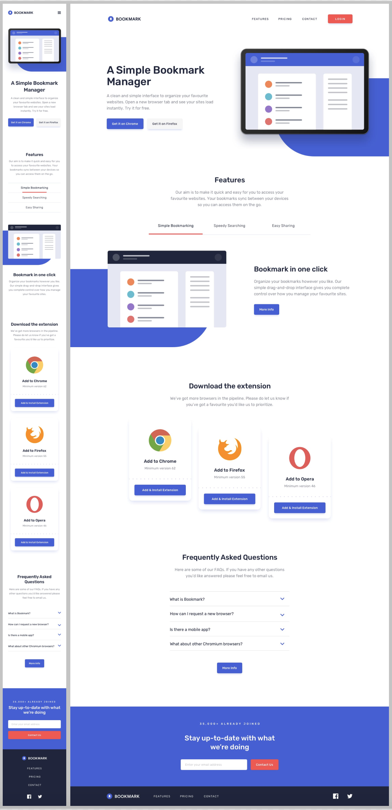

# Bookmark landing page

## Table of contents

- [Overview](#overview)
  - [The challenge](#the-challenge)
  - [Provided wireframes](#provided-wireframes)
  - [Links](#links)
- [My process](#my-process)
  - [Built with](#built-with)
  - [What I learned](#what-i-learned)
- [Author](#author)

## Overview

### The challenge

- Building out a landing page and get it looking as close to the the wireframe provided in png as possible
- The wireframe is in Desktop Design so has to be adapted to tablet
- This page has to be responsive for Mobile and Tablets
- Made it with Sass and using the pseudoclass nth-child to change some positions
- Made it with Bootsrap using the Components:
  - Accordion
  - Buttons
  - Card
  - Navbar
  - Navs & Tabs
- See hover states for all interactive elements on the page
- Receive an error message when the newsletter form is submitted if:
  - The input field is empty
  - The email address is not formatted correctly

### Provided wireframes

### Links

- Code: [https://github1s.com/albavidalm/Bookmark-landing-page-Bootsrap](https://albavidalm.github.io/Bookmark-landing-page-Bootsrap/)
- Live: [https://albavidalm.github.io/Bookmark-landing-page-Bootsrap/](https://albavidalm.github.io/Bookmark-landing-page-Bootsrap/)

## My process

### Built with

- HTML5
- Bootstrap
- Sass

### What I learned

I never used this framework at this level before so I'm very proud about the result. I've learned to use functions and loops in Sass.

## Author

- GitHub: [https://github.com/albavidalm](https://github.com/albavidalm)
- Email: [albavidalm @ gmail.com](mailto:albavidalm@gmail.com?subject=Hi)
- Linkedin: [https://www.linkedin.com/in/albavidalm/](https://www.linkedin.com/in/albavidalm/)

## 🖤 Support

Sharing is caring, contributions and suggestions are always welcome.
